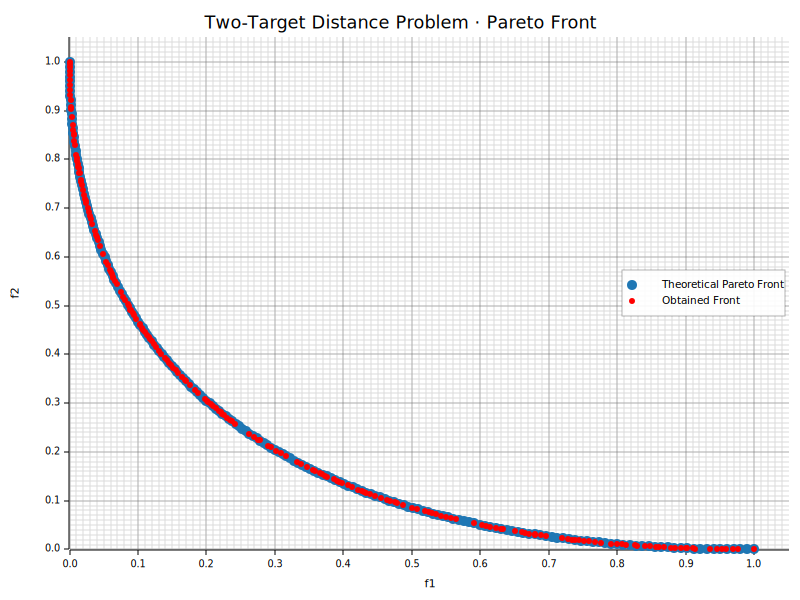

```Rust
:dep ndarray = "*"
:dep moors = "0.2.6"
:dep plotters = "0.3.6"

use ndarray::{Array2, Ix2};
use moors::{
    NoConstraints,
    algorithms::Nsga2Builder,
    duplicates::CloseDuplicatesCleaner,
    operators::{GaussianMutation, SimulatedBinaryCrossover, RandomSamplingFloat},
    genetic::Population
};
use plotters::prelude::*;

// General: compute two-objective fitness (squared distances).
fn fitness_fn(genes: &Array2<f64>) -> Array2<f64> {
    let n = genes.nrows();
    let mut result = Array2::<f64>::zeros((n, 2));

    let x1 = genes.column(0);
    let x2 = genes.column(1);

    let f1 = &x1.mapv(|v| v.powi(2)) + &x2.mapv(|v| v.powi(2));
    let f2 = &x1.mapv(|v| (v - 1.0).powi(2)) + &x2.mapv(|v| v.powi(2));

    result.column_mut(0).assign(&f1);
    result.column_mut(1).assign(&f2);
    result
}

// General: run NSGA-II and collect population.
let population: Population<Ix2, Ix2> = {
    let mut algorithm = Nsga2Builder::default()
        .sampler(RandomSamplingFloat::new(-2.0, 2.0))
        .crossover(SimulatedBinaryCrossover::new(15.0))
        .mutation(GaussianMutation::new(0.1, 0.01))
        .duplicates_cleaner(CloseDuplicatesCleaner::new(1e-16))
        .fitness_fn(fitness_fn)
        .constraints_fn(NoConstraints)
        .num_vars(2)
        .population_size(200)
        .num_offsprings(200)
        .num_iterations(100)
        .mutation_rate(0.2)
        .crossover_rate(0.9)
        .keep_infeasible(false)
        .verbose(false)
        .seed(42)
        .build()
        .unwrap();

    algorithm.run().expect("NSGA2 run failed");
    algorithm.population().unwrap().clone()
};

// General: theoretical Pareto front curve.
let n = 200usize;
let t: Vec<f64> = (0..n).map(|i| i as f64 / (n as f64 - 1.0)).collect();
let f1_theo: Vec<f64> = t.iter().map(|&x| x * x).collect();
let f2_theo: Vec<f64> = t.iter().map(|&x| (x - 1.0).powi(2)).collect();

// General: obtained front from the algorithm.
let fitness = population.fitness;
let f1: Vec<f64> = fitness.column(0).to_vec();
let f2: Vec<f64> = fitness.column(1).to_vec();

// General: define axes with headroom.
let mut x_max = f1.iter().copied().chain(f1_theo.iter().copied()).fold(0.0_f64, f64::max);
let mut y_max = f2.iter().copied().chain(f2_theo.iter().copied()).fold(0.0_f64, f64::max);
x_max = (x_max * 1.05).max(1.0);
y_max = (y_max * 1.05).max(1.0);

// General: render to in-memory SVG and emit as rich output (no files).
let mut svg = String::new();
{
    let backend = SVGBackend::with_string(&mut svg, (800, 600));
    let root = backend.into_drawing_area();
    root.fill(&WHITE).unwrap();

    let mut chart = ChartBuilder::on(&root)
        .caption("Two-Target Distance Problem · Pareto Front", ("DejaVu Sans", 22))
        .margin(10)
        .x_label_area_size(40)
        .y_label_area_size(60)
        .build_cartesian_2d(0f64..x_max, 0f64..y_max)
        .unwrap();

    chart.configure_mesh()
        .x_desc("f1")
        .y_desc("f2")
        .axis_desc_style(("DejaVu Sans", 14))
        .light_line_style(&RGBColor(220, 220, 220))
        .draw()
        .unwrap();

    chart.draw_series(
        f1_theo.iter().zip(f2_theo.iter()).map(|(&x, &y)| {
            Circle::new((x, y), 5, RGBColor(31, 119, 180).filled())
        })
    ).unwrap()
     .label("Theoretical Pareto Front")
     .legend(|(x, y)| Circle::new((x, y), 5, RGBColor(31, 119, 180).filled()));

    chart.draw_series(
        f1.iter().zip(f2.iter()).map(|(&x, &y)| {
            Circle::new((x, y), 3, RGBColor(255, 0, 0).filled())
        })
    ).unwrap()
     .label("Obtained Front")
     .legend(|(x, y)| Circle::new((x, y), 3, RGBColor(255, 0, 0).filled()));

    chart.configure_series_labels()
        .border_style(&RGBAColor(0, 0, 0, 0.3))
        .background_style(&WHITE.mix(0.9))
        .label_font(("DejaVu Sans", 13))
        .draw()
        .unwrap();

    root.present().unwrap();
}

println!("EVCXR_BEGIN_CONTENT image/svg+xml\n{}\nEVCXR_END_CONTENT", svg);

```





```Rust

```
