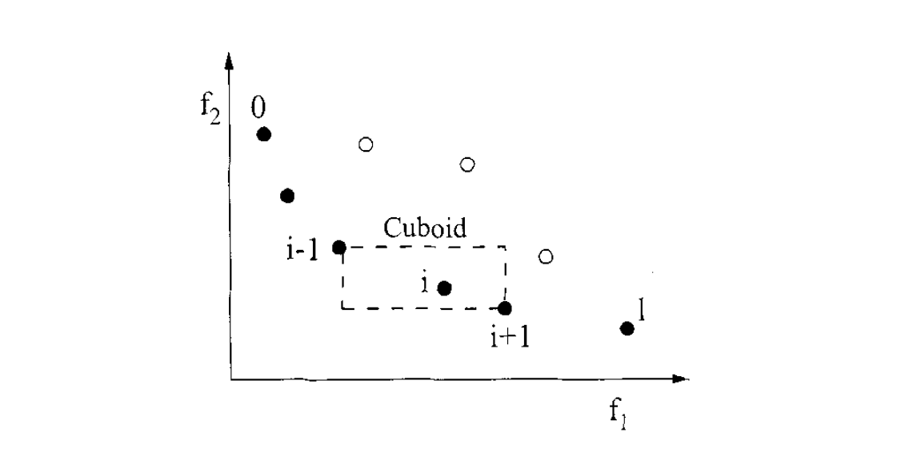

# NSGA-II

NSGA-II is a fast, elitist multiobjective evolutionary algorithm designed to efficiently approximate the Pareto-optimal front. It overcomes several issues found in earlier nondominated sorting approaches by reducing computational complexity, ensuring elitism, and eliminating the need for a sharing parameter.

## Key Features

- **Fast Nondominated Sorting:**
  NSGA-II sorts the population based on Pareto dominance with a computational complexity of
  $O(MN^2)$, where $M$ is the number of objectives and $N$ is the population size.

- **Elitist Selection:**
  The algorithm creates a combined pool of parent and offspring populations. From this pool, the best solutions are chosen based on fitness and diversity. This elitist strategy ensures that the best-found solutions are preserved over generations.

- **Crowding Distance for Diversity Maintenance:**
  To maintain a diverse Pareto front, NSGA-II computes a *crowding distance* for each individual. For each front, the crowding distance $d_i$ of an individual $i$ is calculated as:

  $$
  d_i = \sum_{m=1}^{M} \frac{f_{m}^{(i+1)} - f_{m}^{(i-1)}}{f_{m}^{\max} - f_{m}^{\min}},
  $$

  where:

  - $f_{m}^{(i)}$ is the value of the $m$-th objective for the $i$-th individual (after sorting the individuals according to that objective),
  - $f_{m}^{\max}$ and $f_{m}^{\min}$ are the maximum and minimum values of the $m$-th objective in that front, respectively.

  

  Individuals with a **larger crowding distance** are in less crowded regions and are preferred when selecting among solutions with the same non-domination rank, thereby promoting diversity across the Pareto front.

- **Constraint Handling:**
  When constraints_fn are present, NSGA-II modifies the selection process:
  - **Feasible Solutions First:** Feasible individuals (those satisfying all constraints_fn) are always preferred over infeasible ones.
  - **Ranking:** Among feasible solutions, those with a better (i.e., lower) nondominated rank are favored.
  - **Crowding Distance:** Finally, if individuals share the same rank, the one with a **larger crowding distance** is selected. This ensures that, within the same rank, solutions from less crowded regions of the objective space are chosen.

## ZDT3 Problem

**ZDT3** is a widely used benchmark in multiobjective optimization, especially for testing evolutionary algorithms. It challenges algorithms with:

- **Two Conflicting Objectives:**
  - $f_1(\mathbf{x}) = x_1$
  - $f_2(\mathbf{x}) = g(\mathbf{x}) \cdot h(f_1(\mathbf{x}), g(\mathbf{x}))$

- **Auxiliary Functions:**
  - $g(\mathbf{x}) = 1 + \frac{9}{n-1}\sum_{i=2}^{n} x_i$
  - $h(f_1, g) = 1 - \sqrt{\frac{f_1}{g}} - \frac{f_1}{g}\sin(10\pi f_1)$

- **Key Characteristics:**
  - **Discontinuous Pareto Front:** The optimal solutions are spread over several disconnected segments.
  - **Nonconvexity:** The Pareto front is nonconvex, making convergence more challenging.
  - **Diversity Maintenance:** The discontinuities force algorithms to preserve a diverse set of solutions.

**Domain:**
Each decision variable $x_i$ typically belongs to the interval $[0, 1]$, and the problem is often considered with $n = 30$ variables.

ZDT3 is ideal for evaluating how well an algorithm can balance convergence toward the Pareto-optimal front while maintaining diversity in the presence of a complex, discontinuous solution landscape.

=== "Rust"

    

=== "Python"

    
