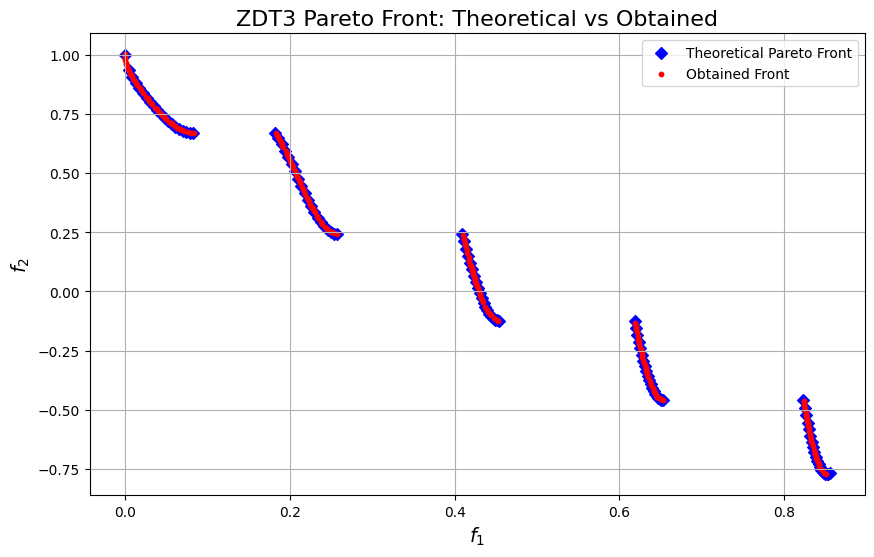

```python
import numpy as np
import matplotlib.pyplot as plt

from pymoors import (
    Nsga2,
    RandomSamplingFloat,
    GaussianMutation,
    ExponentialCrossover,
    CloseDuplicatesCleaner,
    Constraints
)
from pymoors.schemas import Population
from pymoors.typing import TwoDArray

np.seterr(invalid="ignore")


def evaluate_zdt3(population: TwoDArray) -> TwoDArray:
    """
    Evaluate the ZDT3 objectives in a fully vectorized manner.
    """
    # First objective: f1 is simply the first column.
    f1 = population[:, 0]
    n = population.shape[1]
    # Compute g for each candidate: g = 1 + (9/(n-1)) * sum(x[1:])
    g = 1 + (9 / (n - 1)) * np.sum(population[:, 1:], axis=1)
    # Compute h for each candidate: h = 1 - sqrt(f1/g) - (f1/g)*sin(10*pi*f1)
    h = 1 - np.sqrt(f1 / g) - (f1 / g) * np.sin(10 * np.pi * f1)
    # Compute the second objective: f2 = g * h
    f2 = g * h
    return np.column_stack((f1, f2))


def zdt3_theoretical_front():
    """
    Compute the theoretical Pareto front for ZDT3.

    Returns:
        f1_theo (np.ndarray): f1 values on the theoretical front.
        f2_theo (np.ndarray): Corresponding f2 values.

    Instead of using a dense linspace, we sample only a few points per interval to
    clearly illustrate the discontinuous nature of the front.
    """
    # Define the intervals for f1 where the Pareto front exists
    intervals = [
        (0.0, 0.0830015349),
        (0.1822287280, 0.2577623634),
        (0.4093136748, 0.4538828821),
        (0.6183967944, 0.6525117038),
        (0.8233317983, 0.85518),
    ]

    f1_theo = np.array([])
    f2_theo = np.array([])

    # Use a small number of points per interval (e.g., 20) to highlight the discontinuities.
    for start, end in intervals:
        f1_vals = np.linspace(start, end, 20)
        f2_vals = 1 - np.sqrt(f1_vals) - f1_vals * np.sin(10 * np.pi * f1_vals)
        f1_theo = np.concatenate((f1_theo, f1_vals))
        f2_theo = np.concatenate((f2_theo, f2_vals))

    return f1_theo, f2_theo


# Set up the NSGA2 algorithm with the above definitions
algorithm = Nsga2(
    sampler=RandomSamplingFloat(min=0, max=1),
    crossover=ExponentialCrossover(exponential_crossover_rate=0.75),
    mutation=GaussianMutation(gene_mutation_rate=0.1, sigma=0.01),
    fitness_fn=evaluate_zdt3,
    constraints_fn=Constraints(lower_bound=0.0, upper_bound=1.0),
    duplicates_cleaner=CloseDuplicatesCleaner(epsilon=1e-5),
    num_vars=30,
    population_size=200,
    num_offsprings=200,
    num_iterations=300,
    mutation_rate=0.1,
    crossover_rate=0.9,
    keep_infeasible=False,
    verbose=False,
)

# Run the algorithm
algorithm.run()

# Get the best Pareto front obtained (as a Population instance)
best: Population = algorithm.population.best_as_population

# Extract the obtained fitness values (each row is [f1, f2])
obtained_fitness = best.fitness
f1_found = obtained_fitness[:, 0]
f2_found = obtained_fitness[:, 1]

# Compute the theoretical Pareto front for ZDT3
f1_theo, f2_theo = zdt3_theoretical_front()

# Plot the theoretical Pareto front and the obtained front
plt.figure(figsize=(10, 6))
# Plot theoretical front as markers (e.g., diamonds) to show discontinuities.
plt.scatter(
    f1_theo, f2_theo, marker="D", color="blue", label="Theoretical Pareto Front"
)
# Plot obtained front as red circles.
plt.scatter(f1_found, f2_found, c="r", marker="o", s=10, label="Obtained Front")
plt.xlabel("$f_1$", fontsize=14)
plt.ylabel("$f_2$", fontsize=14)
plt.title("ZDT3 Pareto Front: Theoretical vs Obtained", fontsize=16)
plt.legend()
plt.grid(True)
```


