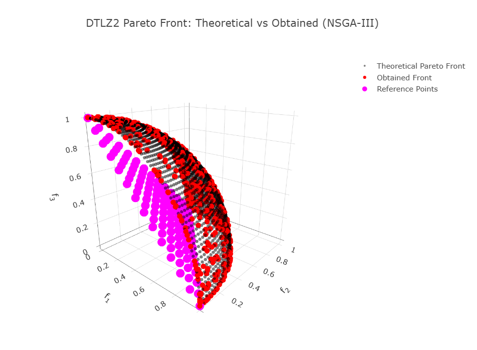

```Rust
:dep ndarray = "*"
:dep moors = "*"
:dep plotly = "*"

use ndarray::{Array1, Array2, Axis, Ix2, s};
use moors::{
    impl_constraints_fn,
    algorithms::Nsga3Builder,
    duplicates::CloseDuplicatesCleaner,
    operators::{
        GaussianMutation,
        RandomSamplingFloat,
        SimulatedBinaryCrossover,
        DanAndDenisReferencePoints,
        StructuredReferencePoints
    },
    genetic::Population,
};

use plotly::{Plot, Scatter3D, Layout, Trace};
use plotly::common::{Mode, Marker, Title, MarkerSymbol};
use plotly::color::NamedColor;
use plotly::layout::{LayoutScene as Scene, Axis as PlotlyAxis};


/// Evaluate the DTLZ2 objectives for a 3-objective problem.
///
/// The decision vector x has num_vars components. For the Pareto front,
/// the auxiliary function g(x) is minimized (g(x)=0) by setting the last
/// num_vars-2 variables to 0.5.
///
/// The objectives are computed as:
///   f1(x) = (1+g) * cos((pi/2)*x1) * cos((pi/2)*x2)
///   f2(x) = (1+g) * cos((pi/2)*x1) * sin((pi/2)*x2)
///   f3(x) = (1+g) * sin((pi/2)*x1)
fn evaluate_dtlz2(genes: &Array2<f64>) -> Array2<f64> {
    let n = genes.nrows();
    let pi_over_2 = std::f64::consts::PI / 2.0;

    // Compute the auxiliary function g(x) using variables 3 to num_vars.
    let tail = genes.slice(s![.., 2..]).to_owned();
    let g_vec: Array1<f64> = tail.mapv(|v| (v - 0.5).powi(2)).sum_axis(Axis(1));

    // x1, x2
    let x1 = genes.column(0).to_owned();
    let x2 = genes.column(1).to_owned();

    // Trig terms
    let cos_x1 = x1.mapv(|v| (pi_over_2 * v).cos());
    let cos_x2 = x2.mapv(|v| (pi_over_2 * v).cos());
    let sin_x1 = x1.mapv(|v| (pi_over_2 * v).sin());
    let sin_x2 = x2.mapv(|v| (pi_over_2 * v).sin());

    let one_plus_g = g_vec.mapv(|g| 1.0 + g);

    // f1, f2, f3 as Array1
    let f1 = &one_plus_g * &cos_x1 * &cos_x2;
    let f2 = &one_plus_g * &cos_x1 * &sin_x2;
    let f3 = &one_plus_g * &sin_x1;

    // Stack into (n, 3)
    let mut result = Array2::<f64>::zeros((n, 3));
    result.column_mut(0).assign(&f1);
    result.column_mut(1).assign(&f2);
    result.column_mut(2).assign(&f3);
    result
}

/// Compute a set of points approximating the theoretical Pareto front for DTLZ2 (3 objectives).
///
/// For the Pareto-optimal front, g(x) = 0, which implies that the decision variables
/// x_3, ..., x_n are fixed at 0.5. Therefore, the front can be generated by varying x1 and x2:
///   f1 = cos((pi/2)*x1) * cos((pi/2)*x2)
///   f2 = cos((pi/2)*x1) * sin((pi/2)*x2)
///   f3 = sin((pi/2)*x1)
/// These points lie on a portion of the unit hypersphere in the positive orthant.
fn dtlz2_theoretical_front(num_points: usize) -> (Vec<f64>, Vec<f64>, Vec<f64>) {
    let pi_over_2 = std::f64::consts::PI / 2.0;

    let mut f1_all = Vec::with_capacity(num_points * num_points);
    let mut f2_all = Vec::with_capacity(num_points * num_points);
    let mut f3_all = Vec::with_capacity(num_points * num_points);

    for i in 0..num_points {
        let x1 = if num_points > 1 {
            i as f64 / (num_points as f64 - 1.0)
        } else {
            0.0
        };
        for j in 0..num_points {
            let x2 = if num_points > 1 {
                j as f64 / (num_points as f64 - 1.0)
            } else {
                0.0
            };

            let f1 = (pi_over_2 * x1).cos() * (pi_over_2 * x2).cos();
            let f2 = (pi_over_2 * x1).cos() * (pi_over_2 * x2).sin();
            let f3 = (pi_over_2 * x1).sin();

            f1_all.push(f1);
            f2_all.push(f2);
            f3_all.push(f3);
        }
    }

    (f1_all, f2_all, f3_all)
}

// Set up the NSGA-III algorithm for DTLZ2.
// For DTLZ2, a typical choice is num_vars = (number of objectives - 1) + k.
// Here, we choose k = 10, so num_vars = 2 + 10 = 12.
impl_constraints_fn!(BoundConstraints, lower_bound = 0.0, upper_bound = 1.0);


let population: Population<Ix2, Ix2> = {
    let rp = DanAndDenisReferencePoints::new(100, 3).generate();

    let mut algorithm = Nsga3Builder::default()
        .sampler(RandomSamplingFloat::new(0.0, 1.0))
        .crossover(SimulatedBinaryCrossover::new(10.0)) // distribution_index = 10
        .mutation(GaussianMutation::new(0.1, 0.01))     // gene_mutation_rate = 0.1, sigma = 0.01
        .reference_points(reference_points)
        .fitness_fn(evaluate_dtlz2)
        .constraints_fn(BoundConstraints)
        .duplicates_cleaner(CloseDuplicatesCleaner::new(1e-8))
        .num_vars(12)
        .population_size(500)
        .num_offsprings(500)
        .num_iterations(700)
        .mutation_rate(0.1)
        .crossover_rate(0.9)
        .keep_infeasible(false)
        .verbose(false)
        .seed(1729)
        .build()
        .expect("Failed to build NSGA3");

    // Run the algorithm
    algorithm.run().expect("NSGA3 run failed");
    algorithm.population.unwrap().clone()
};

// Define again rp just for plotting
let rp_plot: Array2<f64> = DanAndDenisReferencePoints::new(100, 3).generate();
let rp_f1: Vec<f64> = rp_plot.column(0).to_vec();
let rp_f2: Vec<f64> = rp_plot.column(1).to_vec();
let rp_f3: Vec<f64> = rp_plot.column(2).to_vec();

// Get the best Pareto front obtained (as a Population instance)
let fitness = population.fitness;

// Extract the obtained fitness values (each row is [f1, f2, f3])
let f1_found: Vec<f64> = fitness.column(0).to_vec();
let f2_found: Vec<f64> = fitness.column(1).to_vec();
let f3_found: Vec<f64> = fitness.column(2).to_vec();

// Compute the theoretical Pareto front for DTLZ2 (dense grid on the positive octant of the unit sphere)
let (f1_theo, f2_theo, f3_theo) = dtlz2_theoretical_front(50);

// Build Plotly traces for 3D scatter (theoretical vs obtained)
let theoretical_trace = Scatter3D::new(f1_theo.clone(), f2_theo.clone(), f3_theo.clone())
    .mode(Mode::Markers)
    .name("Theoretical Pareto Front")
    .marker(Marker::new().size(3).color(NamedColor::Black).opacity(0.5));

let obtained_trace = Scatter3D::new(f1_found.clone(), f2_found.clone(), f3_found.clone())
    .mode(Mode::Markers)
    .name("Obtained Front")
    .marker(Marker::new().size(5).color(NamedColor::Red));

let refpoints_trace = Scatter3D::new(rp_f1, rp_f2, rp_f3)
    .mode(Mode::Markers)
    .name("Reference Points")
    .marker(
        Marker::new()
            .size(8)
            .color(NamedColor::Magenta)
            .symbol(MarkerSymbol::Star)
    );

// Layout con Title builder y PlotlyAxis (alias para evitar conflicto con ndarray::Axis)
let layout: Layout = Layout::new()
    .width(800)
    .height(600)
    .title(Title::from("DTLZ2 Pareto Front: Theoretical vs Obtained (NSGA-III)"))
    .scene(
        Scene::new()
            .x_axis(PlotlyAxis::new().title(Title::from("f<sub>1</sub>")))
            .y_axis(PlotlyAxis::new().title(Title::from("f<sub>2</sub>")))
            .z_axis(PlotlyAxis::new().title(Title::from("f<sub>3</sub>")))
        // .aspect_mode(plotly::layout::scene::AspectMode::Cube) // opcional
    );

// Compose the plot
let mut plot = Plot::new();
plot.add_trace(theoretical_trace);
plot.add_trace(obtained_trace);
plot.add_trace(refpoints_trace);
plot.set_layout(layout);

// Render as rich HTML for evcxr
let html = plot.to_html();
println!("EVCXR_BEGIN_CONTENT text/html\n{}\nEVCXR_END_CONTENT", html);
```


